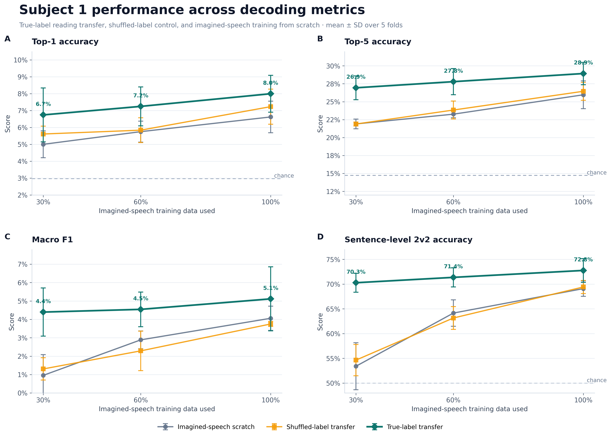
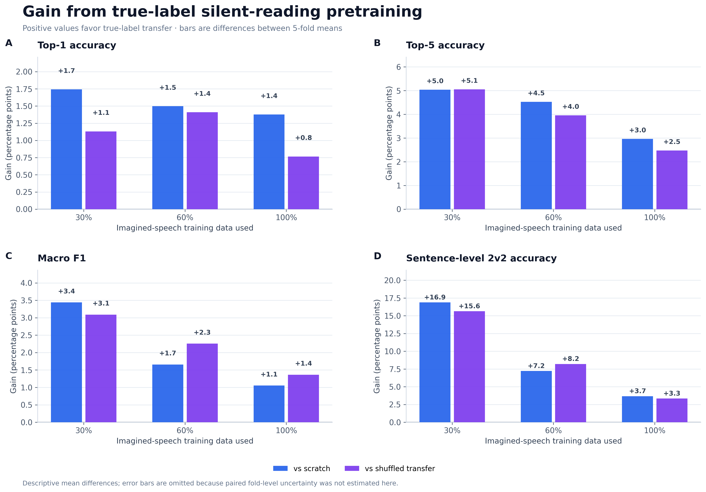

# Silent Reading to Imagined Speech Transfer Learning

This project tests whether an EEG encoder pretrained on **silent-reading EEG** can improve decoding from **imagined-speech EEG**. The experiment is a subject-specific proof of concept using Subject 1 from the paired silent-reading and imagined-speech dataset used in this study. The original published dataset is publicly available through [OpenNeuro, dataset `ds005170`, version 1.1.2](https://openneuro.org/datasets/ds005170/versions/1.1.2).

The central result is clear: across all imagined-speech training-set sizes tested, pretraining with correctly matched silent-reading targets outperformed both:

1. training the same model from scratch on imagined-speech EEG; and
2. pretraining on silent-reading EEG with shuffled sentence and category targets.

This indicates that the transfer benefit is associated with meaningful information learned during silent reading, rather than merely with weight initialization or additional optimization.

## Results

All reported values use the **`best_val_top5` checkpoint** and show the mean ± sample standard deviation across five sentence-disjoint cross-validation folds. Sentence-level 2v2 results use the **`random_overall_trial_uniform`** evaluation mode.



The true-label transfer model achieved the highest mean performance at 30%, 60%, and 100% of the imagined-speech training data across Top-1 accuracy, Top-5 accuracy, Macro F1, and sentence-level 2v2 accuracy.



The benefit was largest in the low-data condition. With only 30% of the imagined-speech training data, true-label transfer improved:

- Top-5 accuracy by **5.0 percentage points** over training from scratch and **5.1 points** over shuffled-label transfer.
- Sentence-level 2v2 accuracy by **16.9 percentage points** over training from scratch and **15.6 points** over shuffled-label transfer.

### Headline results

| Imagined-speech training data | Scratch Top-5 | Shuffled transfer Top-5 | True transfer Top-5 | Scratch 2v2 | Shuffled transfer 2v2 | True transfer 2v2 |
|---:|---:|---:|---:|---:|---:|---:|
| 30% | 21.9% | 21.9% | **26.9%** | 53.4% | 54.6% | **70.3%** |
| 60% | 23.3% | 23.8% | **27.8%** | 64.1% | 63.2% | **71.4%** |
| 100% | 26.0% | 26.5% | **28.9%** | 69.1% | 69.4% | **72.8%** |

## Experimental design

The experiment compares three conditions:

- **Imagined-speech scratch:** the EEG encoder is trained only on imagined-speech trials.
- **Shuffled-label transfer:** the encoder is pretrained on silent-reading EEG after permuting sentence targets and their category labels, then fine-tuned on imagined speech.
- **True-label transfer:** the encoder is pretrained on correctly matched silent-reading EEG and text targets, then fine-tuned on imagined speech.

Fine-tuning is evaluated with nested subsets containing 30%, 60%, or 100% of the imagined-speech training sentences. All conditions use identical outer folds and corresponding imagined-speech subsets.

### Data and splitting

- Subject: `sub-01`
- Semantic categories: 39
- Silent-reading data: 6,057 trials and 5,962 unique sentences
- Imagined-speech data: 6,243 trials and 6,140 unique sentences
- Sentences shared between both phases: 5,637
- Cross-validation: five stratified outer folds
- Split unit: sentence identity

Training, validation, and test sentences are disjoint. Consequently, repeated trials of the same sentence cannot occur in different splits. Each shared sentence appears in exactly one outer test fold.

## Model

The EEG encoder combines:

1. temporal and spatial convolutional layers;
2. a Transformer block with positional encoding;
3. attention pooling; and
4. a 512-dimensional normalized projection head.

Chinese sentences and category names are represented using the frozen [`BAAI/bge-small-zh-v1.5`](https://huggingface.co/BAAI/bge-small-zh-v1.5) text encoder. EEG representations are trained with a combination of sentence-level contrastive alignment and semantic-category classification loss.

## Evaluation

The notebook reports:

- Top-1, Top-2, Top-3, Top-5, and Top-10 category accuracy;
- Macro F1 across the 39 semantic categories;
- sentence-level 2v2 matching accuracy;
- prior-based random baselines for Top-k accuracy; and
- permutation-null estimates for 2v2 evaluation.

The figures above use:

- `best_val_top5` for checkpoint selection;
- `random_overall_trial_uniform` for the displayed 2v2 result;
- 20,000 observed 2v2 pairs per fold; and
- 500 null permutations with 5,000 sampled pairs per permutation.

## Dataset access

The EEG data must be attached or downloaded **before running the notebook**. The code requires both datasets for the selected participant:

1. that subject's imagined-speech files; and
2. the corresponding silent-reading files.

The original published data are available from [OpenNeuro (`ds005170`, version 1.1.2)](https://openneuro.org/datasets/ds005170/versions/1.1.2). For easier use in Kaggle, the subject- and task-specific files used by this notebook are also publicly available through the following Kaggle datasets:

| Subject | Imagined speech | Silent reading |
|---|---|---|
| Subject 01 | [Kaggle dataset](https://www.kaggle.com/datasets/shahryarnamdari/chisco-is-sub01) | [Kaggle dataset](https://www.kaggle.com/datasets/shahryarnamdari/chisco-reading-sub01) |
| Subject 02 | [Kaggle dataset](https://www.kaggle.com/datasets/shahryarnamdari/chisco-is-sub02) | [Kaggle dataset](https://www.kaggle.com/datasets/shahryarnamdari/chisco-reading-sub02) |
| Subject 03 | [Kaggle dataset](https://www.kaggle.com/datasets/shahryarnamdari/chisco-is-sub03) | [Kaggle dataset](https://www.kaggle.com/datasets/shahryarnamdari/chisco-reading-sub03) |
| Subject 04 | [Kaggle dataset](https://www.kaggle.com/datasets/shahryarnamdari/chisco-is-sub04) | [Kaggle dataset](https://www.kaggle.com/datasets/shahryarnamdari/chisco-reading-sub04) |
| Subject 05 | [Kaggle dataset](https://www.kaggle.com/datasets/shahryarnamdari/chisco-is-sub05) | [Kaggle dataset](https://www.kaggle.com/datasets/shahryarnamdari/chisco-reading-sub05) |

To reproduce the results shown here, attach the **Subject 01 imagined-speech** and **Subject 01 silent-reading** datasets to the Kaggle notebook. To run another participant, attach the matching pair from the same row and change `SUBJECT_ID` accordingly.

> The notebook paths must point to the attached Kaggle directories. If Kaggle mounts the datasets under different folder names, update `reading_root` and `imagined_root` in `SUBJECT_CONFIGS` before running the data-loading cells.

## Running the notebook

The complete pipeline is contained in one notebook. The recommended filename is:

```text
silent_reading_to_imagined_speech.ipynb
```

To run it in Kaggle:

1. Open the notebook and select **Add Input**.
2. Attach both the imagined-speech and silent-reading Kaggle datasets for the same subject using the links above.
3. Set `SUBJECT_ID`, then verify the subject's `reading_root` and `imagined_root` paths under `SUBJECT_CONFIGS`.
4. Use `READING_LABEL_MODES = ["true", "shuffled"]` to reproduce both transfer conditions in one run.
5. Enable a GPU accelerator and run all cells in order.
